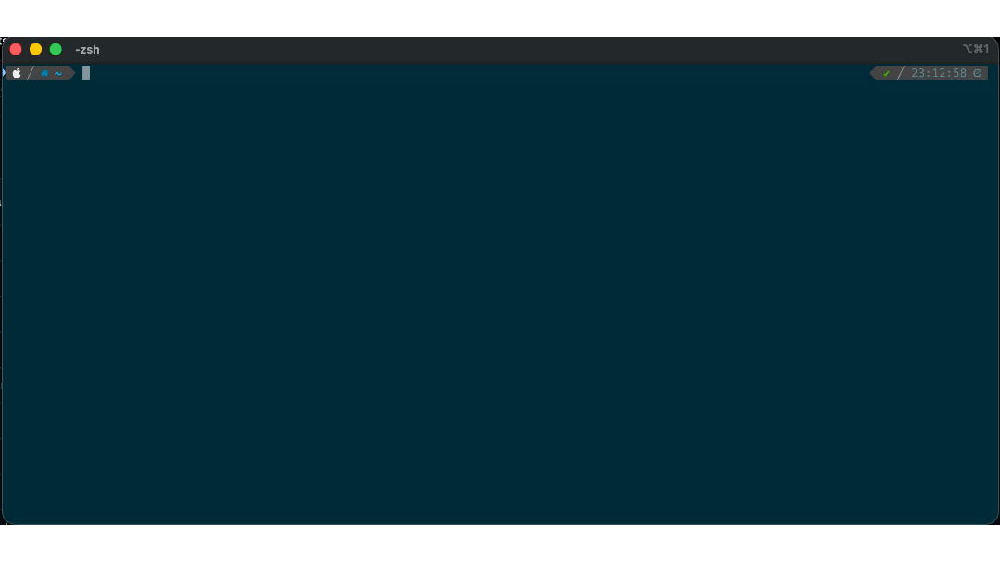

# sleuther

Local terminal error triage for Oh My Zsh, backed by Ollama.

When a command fails, `sleuther` can explain the likely root cause and suggest one safe next command. By default it stays local, asks before running anything, and falls back to a manual mode when the shell cannot provide enough context.



## What It Actually Does

- Watches failed commands through zsh hooks.
- Sends the failed command, exit code, and available context to your local Ollama server.
- Renders the model response in the terminal.
- Optionally offers one suggested command for you to approve.
- Provides a manual `sleuther "paste the error here"` path when you want richer context.

Important limitation: zsh hooks do not expose the previous command's stdout/stderr. Auto mode does not replay the failed command, so the model usually sees only the command text and exit code unless you paste the error yourself.

## Quick Start

Prerequisites:

- [Oh My Zsh](https://ohmyz.sh/)
- [Ollama](https://ollama.com/download)
- `curl`
- `python3`

Install:

```bash
git clone https://github.com/chocks/sleuther \
  ${ZSH_CUSTOM:-~/.oh-my-zsh/custom}/plugins/sleuther
```

Add `sleuther` to your `plugins=(...)` list in `~/.zshrc`, then pull the default model and reload your shell:

```bash
ollama pull qwen2.5-coder:7b
source ~/.zshrc
```

You can also run the bundled helper:

```bash
${ZSH_CUSTOM:-~/.oh-my-zsh/custom}/plugins/sleuther/bin/ollama-helper setup
```

## Usage

Automatic mode:

```bash
$ npm install
npm ERR! enoent Could not read package.json
```

If the command exits non-zero, `sleuther` may show:

- `Root Cause`
- `Fix`
- `Suggested Command`

Manual mode:

```bash
sleuther "ModuleNotFoundError: No module named 'pandas'"
```

Use manual mode whenever the exact stderr matters.

## Safety Model

- Default endpoint is local: `http://localhost:11434`.
- Non-local Ollama URLs are rejected and reset to `http://localhost:11434`.
- Suggested commands are executed as argv tokens via zsh parsing, not `eval`.
- Suggested commands must be a single command. Chaining, pipes, redirection, subshells, and interpolation are blocked.
- Commands that look destructive, privileged, network-oriented, or remotely controlled are blocked from execution.
- `SLEUTHER_AUTO_RUN` is off by default. Leave it off unless you accept the risk of running model-generated commands automatically.

This reduces risk; it does not make model output trustworthy. Always review the suggested command before accepting it.

## Privacy

Data goes only to your local Ollama instance. If `SLEUTHER_OLLAMA_URL` is set to a non-loopback address, `sleuther` ignores it and resets to `http://localhost:11434`.

After rejecting the same cached suggestion twice, `sleuther` offers a sanitized report you can paste into another tool. The sanitizer currently removes:

- home directory and username
- hostname
- common email addresses
- IPv4 addresses
- simple `token=` / `password=` style secrets

Treat the sanitized export as best-effort, not guaranteed redaction.

## Configuration

Create `~/.config/sleuther/config`:

```bash
SLEUTHER_MODEL="qwen2.5-coder:7b"
SLEUTHER_AUTO_RUN=false
SLEUTHER_OLLAMA_URL="http://localhost:11434"
SLEUTHER_TIMEOUT=30
SLEUTHER_KEEP_ALIVE="10m"
```

Settings:

| Setting | Default | Notes |
|---|---|---|
| `SLEUTHER_MODEL` | `qwen2.5-coder:7b` | Ollama model name |
| `SLEUTHER_AUTO_RUN` | `false` | Auto-execute approved-safe suggestions |
| `SLEUTHER_OLLAMA_URL` | `http://localhost:11434` | Ollama endpoint, loopback only |
| `SLEUTHER_TIMEOUT` | `30` | Request timeout in seconds |
| `SLEUTHER_KEEP_ALIVE` | `10m` | Ask Ollama to keep the model loaded between requests |

Invalid config values are ignored and fall back to safe defaults.

## Developer Notes

- Entry point: [sleuther.plugin.zsh](/Users/chockalingameswaramurthy/Documents/repos/sleuther/sleuther.plugin.zsh)
- Prompt and language routing: [lib/detect.zsh](/Users/chockalingameswaramurthy/Documents/repos/sleuther/lib/detect.zsh)
- Ollama client: [lib/ollama.zsh](/Users/chockalingameswaramurthy/Documents/repos/sleuther/lib/ollama.zsh)
- Execution guard: [lib/display.zsh](/Users/chockalingameswaramurthy/Documents/repos/sleuther/lib/display.zsh)
- Sanitized export: [lib/sanitize.zsh](/Users/chockalingameswaramurthy/Documents/repos/sleuther/lib/sanitize.zsh)

For the repo layout and extension points, see [CONTRIBUTING.md](/Users/chockalingameswaramurthy/Documents/repos/sleuther/CONTRIBUTING.md).

## Optional Rendering

If you install [glow](https://github.com/charmbracelet/glow), markdown output is rendered more cleanly. Without it, `sleuther` uses a built-in ANSI fallback.

## Uninstall

Remove `sleuther` from `plugins=(...)`, delete the plugin directory, and optionally remove:

```bash
rm -rf ~/.config/sleuther
rm -rf ${TMPDIR:-/tmp}/sleuther-cache
```

## License

MIT
